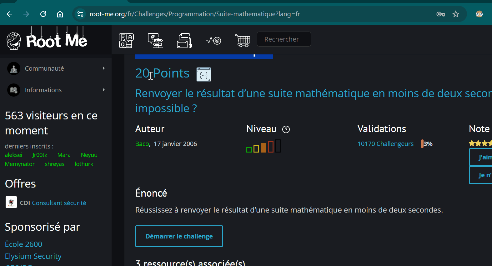

# CTF Buddy 2.0

> 🇫🇷 [Français](#français) | 🇬🇧 [English](#english)

---

## Français

<div align="center">



**Un assistant CTF propulsé par l'IA — AWS Bedrock + Strands SDK**

[](LICENSE)
[](https://www.python.org/)
[](https://aws.amazon.com/bedrock/)

</div>

### C'est quoi ?

CTF Buddy 2.0 est un agent IA qui résout des challenges Capture The Flag de manière autonome.
Il analyse le challenge, choisit les bons outils, écrit du code si nécessaire, et soumet la réponse — sans intervention humaine.

Construit sur **AWS Bedrock (Claude)** et le **Strands SDK**, il suit une architecture en deux couches qui lui permet de s'adapter à n'importe quel type de challenge.

### Architecture — deux couches

**Couche 1 — Outils directs** pour les challenges connus :
l'agent appelle des outils pré-construits selon la catégorie du challenge.

**Couche 2 — Workspace** pour les challenges complexes ou inconnus :
l'agent écrit et exécute du code Python personnalisé qui importe les outils comme bibliothèques,
s'adaptant à n'importe quel format sans casser l'existant.

```
Challenge inconnu
      │
      ▼
web_fetch_challenge()     ← l'agent lit la page brute
      │
      ▼
write_and_run(code)       ← l'agent écrit un script sur mesure
      │                      (peut importer n'importe quel outil)
      ▼
submit_answer()           ← soumission du résultat
```

### Outils disponibles

| Catégorie | Général (d'abord) | Spécifique (ensuite) |
|---|---|---|
| **Réseau** | `pcap_inspect` | `pcap_get_stream` |
| **Crypto** | `encoding_identify` | `decode_base64`, `decode_hex`, `decode_rot`, `decode_binary`, `decode_url`, `hash_identify` |
| **Web** | `web_inspect` | `web_get_paths`, `web_fuzz_param`, `web_inspect_cookie`, `web_solve_image_captcha` |
| **Forensics** | `file_inspect` | `file_extract_strings`, `file_check_stego`, `file_extract_metadata` |
| **Workspace** | `web_fetch_challenge` | `write_and_run`, `read_workspace`, `submit_answer` |

### Philosophie des outils

Chaque catégorie suit le même principe : **général d'abord, spécifique ensuite.**

L'outil général scanne tout et retourne ce qu'il a trouvé + les prochaines étapes recommandées.
L'agent décide ensuite quel outil spécifique appeler selon les résultats.

### Installation

**1. Prérequis**
- Python 3.10+
- **Option A (défaut) :** Compte AWS avec accès à Bedrock (modèles Claude activés en `us-west-2`)
- **Option B :** Clé API Anthropic — [console.anthropic.com](https://console.anthropic.com)

**2. Cloner le repo**
```bash
git clone https://github.com/khalil-secure/CTF_buddy_2.git
cd CTF_buddy_2
```

**3. Installer les dépendances**
```bash
python -m venv .venv

# Windows
.venv\Scripts\pip install -r requirements.txt

# Mac/Linux
.venv/bin/pip install -r requirements.txt
```

**4. Configurer les credentials**
```bash
cp example.env .env
# Remplir les credentials dans .env
# Option A (défaut) : credentials AWS Bedrock
# Option B : ANTHROPIC_API_KEY — le projet détecte automatiquement
```

**5. Lancer**
```bash
# Windows
.venv\Scripts\python agent.py

# Mac/Linux
.venv/bin/python agent.py
```

### Exemples d'utilisation

```
You: solve the math sequence challenge at http://challenge01.root-me.org/programmation/ch1/
You: inspect this pcap file at /path/to/capture.pcap
You: decode this string: aGVsbG8gd29ybGQ=
You: check this image for steganography: /path/to/image.png
You: solve the captcha challenge at http://challenge01.root-me.org/programmation/ch8/
```

### Prochaines étapes — CTF Buddy 3.0

L'objectif suivant est de passer d'un agent unique à une **architecture multi-agents (A2A)**.

```
Orchestrateur CTF
      │
      ├── Agent Réseau    ← spécialisé pcap, protocoles
      ├── Agent Crypto    ← spécialisé encodages, hash, chiffrement
      ├── Agent Web       ← spécialisé HTTP, injection, sessions
      └── Agent Forensics ← spécialisé fichiers, stéganographie, métadonnées
```

**Pourquoi ?**
- Les challenges CTF avancés croisent plusieurs catégories en même temps
- Chaque agent spécialisé aura un contexte plus court et plus précis → moins de confusion
- L'orchestrateur décompose le problème et délègue aux bons agents en parallèle
- Les agents peuvent se transmettre des résultats intermédiaires (ex : Réseau extrait un flux → Crypto le décode)

**Stack prévue :** Strands SDK A2A + AWS Bedrock, même base de tools.

### Construit sur

- [Strands Agents SDK](https://github.com/strands-agents/sdk-python) — framework d'agents IA
- [AWS Bedrock](https://aws.amazon.com/bedrock/) — Claude comme modèle de raisonnement
- [Once Upon an Agentic AI](https://catalog.us-east-1.prod.workshops.aws/workshops/e1493217-4bc7-42f4-87d9-e231acd743bc) — workshop AWS qui a inspiré l'architecture

---

## English

<div align="center">


**An AI-powered CTF assistant — AWS Bedrock + Strands SDK**

[](LICENSE)
[](https://www.python.org/)
[](https://aws.amazon.com/bedrock/)

</div>

### What is it?

CTF Buddy 2.0 is an AI agent that solves Capture The Flag challenges autonomously.
It reads the challenge, picks the right tools, writes custom code when needed, and submits the answer — no human intervention required.

Built on **AWS Bedrock (Claude)** and the **Strands SDK**, it uses a two-layer architecture that lets it adapt to any challenge type.

### Architecture — two layers

**Layer 1 — Direct tools** for known challenge types:
the agent calls pre-built tools based on the challenge category.

**Layer 2 — Workspace** for harder or unknown challenges:
the agent writes and runs custom Python code that imports the tools as utilities,
adapting to any challenge format without breaking the existing toolset.

```
Unknown challenge
      │
      ▼
web_fetch_challenge()     ← agent reads the raw page
      │
      ▼
write_and_run(code)       ← agent writes a custom script
      │                      (can import any tool as a library)
      ▼
submit_answer()           ← submits the result
```

### Available tools

| Category | General (first) | Specific (then) |
|---|---|---|
| **Network** | `pcap_inspect` | `pcap_get_stream` |
| **Crypto** | `encoding_identify` | `decode_base64`, `decode_hex`, `decode_rot`, `decode_binary`, `decode_url`, `hash_identify` |
| **Web** | `web_inspect` | `web_get_paths`, `web_fuzz_param`, `web_inspect_cookie`, `web_solve_image_captcha` |
| **Forensics** | `file_inspect` | `file_extract_strings`, `file_check_stego`, `file_extract_metadata` |
| **Workspace** | `web_fetch_challenge` | `write_and_run`, `read_workspace`, `submit_answer` |

### Tool philosophy

Every category follows the same principle: **general first, specific second.**

The general tool scans everything and returns findings + recommended next steps.
The agent then decides which specific tool to call based on the results.

### Installation

**1. Prerequisites**
- Python 3.10+
- **Option A (default):** AWS account with Bedrock access (Claude models enabled in `us-west-2`)
- **Option B:** Anthropic API key — [console.anthropic.com](https://console.anthropic.com)

**2. Clone the repo**
```bash
git clone https://github.com/khalil-secure/CTF_buddy_2.git
cd CTF_buddy_2
```

**3. Install dependencies**
```bash
python -m venv .venv

# Windows
.venv\Scripts\pip install -r requirements.txt

# Mac/Linux
.venv/bin/pip install -r requirements.txt
```

**4. Configure credentials**
```bash
cp example.env .env
# Fill in your credentials in .env
# Option A (default): AWS Bedrock credentials
# Option B: ANTHROPIC_API_KEY — the project auto-detects which backend to use
```

**5. Run**
```bash
# Windows
.venv\Scripts\python agent.py

# Mac/Linux
.venv/bin/python agent.py
```

### Example usage

```
You: solve the math sequence challenge at http://challenge01.root-me.org/programmation/ch1/
You: inspect this pcap file at /path/to/capture.pcap
You: decode this string: aGVsbG8gd29ybGQ=
You: check this image for steganography: /path/to/image.png
You: solve the captcha challenge at http://challenge01.root-me.org/programmation/ch8/
```

### What's next — CTF Buddy 3.0

The next objective is to move from a single agent to a **multi-agent (A2A) architecture**.

```
CTF Orchestrator
      │
      ├── Network Agent    ← specialized in pcap, protocols
      ├── Crypto Agent     ← specialized in encodings, hashes, ciphers
      ├── Web Agent        ← specialized in HTTP, injection, sessions
      └── Forensics Agent  ← specialized in files, steganography, metadata
```

**Why?**
- Advanced CTF challenges span multiple categories at once
- Each specialized agent gets a shorter, sharper context → less confusion
- The orchestrator breaks the problem down and delegates to the right agents in parallel
- Agents can pass intermediate results to each other (e.g. Network extracts a stream → Crypto decodes it)

**Planned stack:** Strands SDK A2A + AWS Bedrock, same tool base.

### Built with

- [Strands Agents SDK](https://github.com/strands-agents/sdk-python) — AI agent framework
- [AWS Bedrock](https://aws.amazon.com/bedrock/) — Claude as the reasoning model
- [Once Upon an Agentic AI](https://catalog.us-east-1.prod.workshops.aws/workshops/e1493217-4bc7-42f4-87d9-e231acd743bc) — AWS workshop that inspired the architecture

---

<div align="center">
Made by <a href="https://github.com/khalil-secure">khalil-secure</a> · MIT License
</div>
